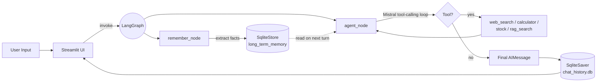

# LangGraph Chatbot

> A production-style multi-tool AI assistant built with **LangGraph**, **Mistral AI**, and **Streamlit** — featuring RAG, persistent multi-session memory, and a configurable settings panel.


---

## Overview

This project is a **production-grade conversational AI assistant** built on top of LangGraph's stateful graph runtime and the Mistral AI tool-calling API. It is designed to look and behave like a real-world AI product (think *ChatGPT-lite*): users can hold multiple persistent conversations, upload PDF/TXT documents and ask questions over them (RAG), and have the assistant call live tools (web search, stock prices, calculator) inside a single agent loop.

The codebase is organized in an MLOps-friendly structure — configuration-driven (`configs/config.yaml`), centrally logged, SQLite-persisted, and split into composable modules (graph, memory, RAG, tools, session, UI) so each piece can evolve independently.

---

## Key Features

- **LangGraph agent loop** — Mistral AI tool-calling implemented as a stateful graph node with `START → (agent ∥ remember) → END` parallel execution.
- **4 callable tools** out of the box:
  - `web_search` — live DuckDuckGo search
  - `calculator` — safe math via `numexpr`
  - `get_stock_price` — real-time quotes via `yfinance`
  - `rag_search` — semantic search over user-uploaded documents
- **RAG pipeline** — PDF/TXT ingestion → chunking → MiniLM embeddings → per-session FAISS vector store.
- **Two-tier memory:**
  - *Short-term:* sliding window + LLM summarization to stay within the context window.
  - *Long-term:* fact extraction stored in a custom `SqliteStore` (LangGraph `BaseStore`).
- **Persistent multi-session chat** — every conversation is checkpointed in SQLite and listed in a ChatGPT-style sidebar with auto-generated titles.
- **Runtime settings page** — adjust model, temperature, max-tokens, memory window, summary threshold, and RAG top-k from the UI without restarting the app.
- **Tool-call indicator** — shows which tools the agent used for each response.
- **Streamlit Cloud-ready** — auto-creates data directories and DB tables on first boot.

---

## Demo / Screenshots

> Add screenshots / GIFs here to showcase the UI.

```
docs/
└── screenshots/
    ├── chat-ui.png          <!-- TODO: main chat screen -->
    ├── settings-page.png    <!-- TODO: settings panel -->
    ├── rag-upload.gif       <!-- TODO: document upload + Q&A flow -->
    └── tool-indicator.png   <!-- TODO: tool call indicator -->
```

A short demo video can be embedded with:

```markdown

```

---

## Architecture

The system is organized around a **LangGraph StateGraph** that runs two nodes in parallel on every user turn:



**Per-turn flow:**

1. User sends a message via Streamlit.
2. The graph runs `agent_node` and `remember_node` **in parallel** (no added latency).
3. `agent_node` builds the LLM context from: long-term memory facts → optional RAG hint → optional running summary → the last *N* messages, then enters a Mistral tool-calling loop until the model returns a final answer.
4. `remember_node` asks Mistral to extract new user facts from recent messages and merges them into the persistent `SqliteStore`.
5. Both new messages and graph state are checkpointed via `SqliteSaver`, so reloading the session restores the full conversation.

**RAG flow (when a document is uploaded):**

```
PDF / TXT → pypdf / read_text → fixed-size chunking (with overlap)
        → sentence-transformers (all-MiniLM-L6-v2) → FAISS IndexFlatL2
        → per-session .index + .pkl files under data/vector_store/
```

---

## Tech Stack

| Layer | Technology |
|---|---|
| **Language** | Python 3.11+ |
| **Agent runtime** | LangGraph (`StateGraph`, `SqliteSaver`, custom `BaseStore`) |
| **LLM** | Mistral AI (`mistral-small-latest` / `medium` / `large`) via the official `mistralai` SDK |
| **Embeddings** | `sentence-transformers` — `all-MiniLM-L6-v2` |
| **Vector store** | FAISS (`IndexFlatL2`, CPU) |
| **Tooling** | LangChain Core (`@tool`), `duckduckgo-search`, `yfinance`, `numexpr` |
| **Persistence** | SQLite (chat history, sessions table, long-term memory) |
| **Frontend** | Streamlit + `streamlit-chat` |
| **Config** | YAML (`configs/config.yaml`) + runtime override store |
| **Logging** | Python `logging` with config-driven format/level |
| **Deployment** | Streamlit Cloud (live), Docker (scaffolded) <!-- TODO: finish Dockerfile --> |

---

## Project Structure

```
Chatbot_new/
├── main.py                      # CLI entry point
├── ui/
│   ├── app.py                   # Streamlit entry point
│   ├── pages/
│   │   └── settings.py          # Runtime settings page (sliders/dropdowns)
│   └── components/
│       ├── sidebar.py           # Session list + new chat
│       ├── file_upload.py       # PDF/TXT upload for RAG
│       └── styles.py
├── src/
│   ├── graph/
│   │   ├── builder.py           # Compiles the LangGraph + SqliteSaver + SqliteStore
│   │   ├── state.py             # ChatState TypedDict (messages, summary)
│   │   └── nodes/
│   │       ├── agent.py         # Mistral tool-calling loop
│   │       └── remember.py      # Long-term fact extraction
│   ├── agents/tools/
│   │   ├── search.py            # web_search (DuckDuckGo)
│   │   ├── calculator.py        # calculator (numexpr)
│   │   ├── stock.py             # get_stock_price (yfinance)
│   │   └── rag_search.py        # rag_search (FAISS)
│   ├── rag/
│   │   ├── ingestion.py         # PDF/TXT loader + chunker
│   │   ├── embeddings.py        # SentenceTransformer + FAISS index
│   │   └── retriever.py         # High-level index/retrieve API
│   ├── memory/
│   │   ├── short_term.py        # Summarization + window logic
│   │   └── long_term.py         # Custom SqliteStore + fact extraction
│   ├── session/
│   │   └── manager.py           # Sessions table, title generation
│   ├── utils/
│   │   ├── config_loader.py     # Loads configs/config.yaml
│   │   ├── runtime_config.py    # Mutable settings overrides + tool-call log
│   │   └── logger.py            # Central logger
│   └── mcp/                     # MCP server/client scaffolding (WIP)
├── configs/
│   ├── config.yaml              # Model, memory, RAG, logging, session DB
│   ├── agents.yaml              # <!-- TODO -->
│   ├── prompts.yaml             # <!-- TODO -->
│   └── rag.yaml                 # <!-- TODO -->
├── scripts/
│   ├── ingest.py                # Offline ingestion helper
│   └── setup_db.py              # DB bootstrap helper
├── docker/
│   ├── Dockerfile               # <!-- TODO: finish image -->
│   └── docker-compose.yml       # <!-- TODO -->
├── tests/                       # unit/ + integration/ (scaffolded)
├── data/                        # auto-created: chat_history.db + vector_store/
├── requirements.txt
├── pyproject.toml
├── Makefile                     # <!-- TODO: add common targets -->
├── LICENSE                      # MIT
└── README.md
```

---

## Getting Started

### Prerequisites

- Python **3.11+**
- A **Mistral AI** API key (free tier works) — https://console.mistral.ai/
- (Optional) `conda` for environment isolation
- ~1 GB free disk for the MiniLM embeddings model on first run

### Installation

```bash
# 1. Clone
git clone https://github.com/<your-username>/Chatbot_new.git
cd Chatbot_new

# 2. Create environment
conda create -n chatbot python=3.11 -y
conda activate chatbot

# 3. Install (editable mode — required because the project uses `from src...` imports)
pip install -e .
pip install -r requirements.txt
```

### Environment Setup

Create a `.env` file in the project root:

```env
MISTRAL_API_KEY=your_mistral_api_key_here
# Optional — currently unused by default tools:
GOOGLE_API_KEY=
OPENWEATHER_API_KEY=
```

> The SQLite DB (`data/chat_history.db`) and FAISS vector store (`data/vector_store/`) are **auto-created on first run** — no manual setup needed.

---

## Usage

### Run the Streamlit UI

```bash
streamlit run ui/app.py
```

Then open http://localhost:8501.

### Run the CLI

```bash
python main.py
```

```
Session ID: 8e4f...
Chatbot ready. Type 'exit' to quit.

You: what is the price of AAPL?
Bot: Stock info for Apple Inc. (AAPL):
       Price     : $...
       52W High  : $...
       ...
```

### Try the tools

| Ask the bot | Tool triggered |
|---|---|
| `what's the latest news about openai` | `web_search` |
| `calculate sqrt(144) + 5` | `calculator` |
| `price of TSLA` | `get_stock_price` |
| *(after uploading a PDF)* `summarize the document` | `rag_search` |

### Upload a document for RAG

1. In the Streamlit sidebar → **Documents** → upload a `.pdf` or `.txt`.
2. The file is chunked, embedded, and indexed per-session.
3. Ask any question — the agent will automatically use `rag_search`.

### Tune runtime settings

Open the **Settings** page (left nav). Sliders for:

- Model (`small` / `medium` / `large`), Temperature, Max Tokens
- Memory: Window size, Summary threshold
- RAG: Top-K

Changes apply on the **next message** — no restart required.

---

## Dataset

This project **does not ship with a training dataset**. The RAG component operates on **user-uploaded documents at runtime**:

- Supported formats: **PDF**, **TXT**
- Preprocessing: fixed-size character chunking with overlap (default `chunk_size=500`, `overlap=50` — see `configs/config.yaml`)
- Embeddings: `all-MiniLM-L6-v2` (384-dim, MIT-licensed, runs on CPU)
- Storage: one FAISS `IndexFlatL2` + chunk pickle **per chat session**

---

## Model Details

The project does not train a model — it orchestrates a **hosted LLM (Mistral)** plus a local **sentence-embedding model**.

### LLM

| Item | Value |
|---|---|
| Provider | Mistral AI (REST API) |
| Default model | `mistral-small-latest` |
| Selectable at runtime | `small` / `medium` / `large` |
| Default temperature | `0.7` |
| Default max tokens | `1024` |
| Tool-calling | Native Mistral function-calling, executed in a `while True` loop until no `tool_calls` are returned |

### Embedding model

| Item | Value |
|---|---|
| Model | `sentence-transformers/all-MiniLM-L6-v2` |
| Dimension | 384 |
| Index | FAISS `IndexFlatL2` |
| Default top-k | 3 |

### Memory hyperparameters (`configs/config.yaml`)

| Param | Default | Purpose |
|---|---|---|
| `memory.window_size` | 6 | Number of recent messages sent to LLM |
| `memory.summary_threshold` | 20 | After this many messages, older ones are summarized |
| `rag.chunk_size` | 500 | Characters per chunk |
| `rag.chunk_overlap` | 50 | Sliding overlap between chunks |
| `rag.top_k` | 3 | Chunks retrieved per query |

---

## Results

This is a **systems / engineering project**, not a benchmarked ML model. No accuracy metrics are reported. Qualitative observations during testing:

| Aspect | Observed behavior |
|---|---|
| Tool selection | Correctly routes math / search / stock / document queries to the right tool in the vast majority of test prompts. <!-- TODO: replace with measured pass rate --> |
| Memory recall | Long-term facts (name, preferences) persist across sessions and are injected into subsequent prompts. |
| RAG quality | `all-MiniLM-L6-v2` + top-3 retrieval is sufficient for short technical PDFs (<50 pages). <!-- TODO: add eval set --> |
| Latency | Parallel `agent + remember` adds **no perceptible latency** vs. running agent alone. <!-- TODO: add wall-clock numbers --> |

> A more rigorous evaluation suite (tool-routing accuracy, RAG hit-rate, faithfulness) is planned — see Roadmap.

---

## Roadmap / Future Work

- [ ] **FastAPI backend** exposing `POST /chat`, `GET /sessions`, `GET /memory`, `DELETE /memory/{key}` so the chatbot can be consumed by any frontend.
- [ ] **MCP integration** — there is a scaffolded `src/mcp/` module; goal is to plug external MCP servers as additional toolsets.
- [ ] **Streaming responses** via Mistral streaming + `st.write_stream`.
- [ ] **Live tool indicator** using `st.status` (currently a static caption after the response).
- [ ] **Evaluation suite** — tool-routing accuracy, RAG faithfulness, regression tests in `tests/integration/`.
- [ ] **Finish Dockerfile + `docker-compose.yml`** for one-command deployment.
- [ ] **CI/CD** — GitHub Actions for lint + tests + Docker build.
- [ ] **Custom CSS theme** for a more polished look.
- [ ] **Session-scoped `uploaded_docs`** (currently lives in `st.session_state`, not in the DB).

---

## Contributing

PRs welcome. Quick guidelines:

1. Open an issue first for non-trivial changes.
2. Follow the existing module layout (`graph` / `memory` / `rag` / `agents` / `session` / `utils`).
3. Add a logger line on any new module — the project relies on structured logs for debugging.
4. New tools go under `src/agents/tools/` and must be registered in `src/agents/tools/__init__.py::ALL_TOOLS`.
5. Run the app locally (`streamlit run ui/app.py`) before opening a PR.

```bash
# Quick smoke test
python main.py
streamlit run ui/app.py
```

---

## License

This project is licensed under the **MIT License** — see [LICENSE](LICENSE) for the full text.

---

## Acknowledgements

- [LangGraph](https://github.com/langchain-ai/langgraph) for the stateful graph runtime.
- [Mistral AI](https://mistral.ai/) for the LLM API and tool-calling spec.
- [`sentence-transformers`](https://www.sbert.net/) and [FAISS](https://github.com/facebookresearch/faiss) for embeddings and ANN.
- [Streamlit](https://streamlit.io/) for the UI layer.

## Contact

**Nirav Rupapara**

- GitHub: [@niravrupapara](https://github.com/niravrupapara) <!-- TODO: confirm handle -->
- Email: <!-- TODO: add public contact email -->
- LinkedIn: <!-- TODO: add LinkedIn URL -->

---

*Built as a portfolio project demonstrating end-to-end MLOps-style structure: config-driven, logged, persisted, modular, and deployable.*
