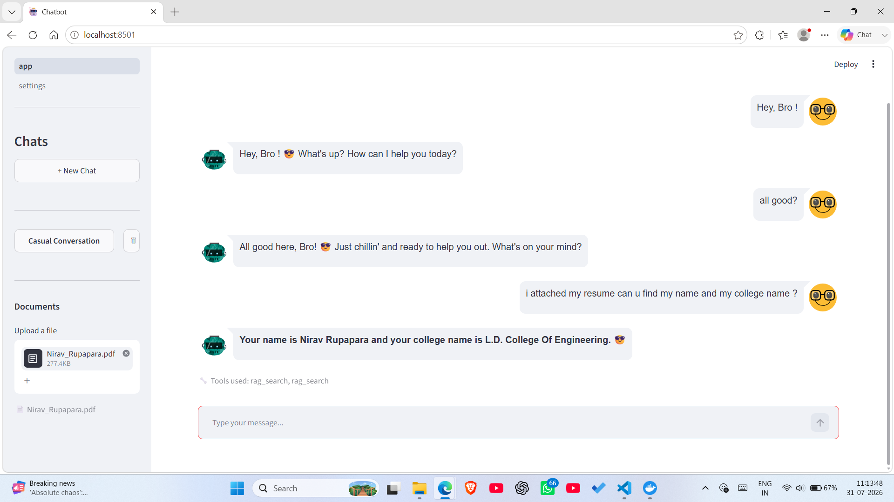
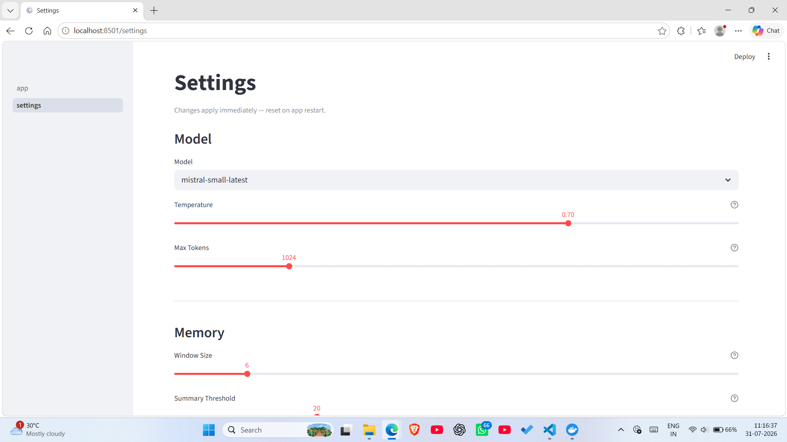

<div align="center">

# 🤖 LangGraph Multi-Tool AI Assistant & REST Service

**An enterprise-grade, multi-tool AI Agent system** built with LangGraph, Mistral AI, Streamlit, and FastAPI — featuring per-session RAG, two-tier persistent memory, native tool calling, automatic chat title generation, dual logging storage, and Docker containerization.

[](https://hub.docker.com/r/niravrupapara/chatbot)


</div>

---

## 📌 Executive Summary

**LangGraph Multi-Tool AI Assistant** is a production-ready conversational AI system featuring:

- 🛠️ **Native Tool Calling**: Autonomous multi-turn execution (Web search, Math, Stock quotes, Document search)
- 📚 **Session-Based RAG**: PDF text chunking, `all-MiniLM-L6-v2` embeddings, and per-session FAISS vector search
- 🧠 **Two-Tier Cognitive Memory**: Short-term window summarization + parallel long-term SQLite user fact store
- 📱 **Interactive Streamlit UI**: Multi-session sidebar management with automatic chat title generation (~0.3s)
- 📁 **Dual Logging Storage**: Live console terminal logs + auto-incrementing timestamped log files (`logs/app_001_YYYY-MM-DD_HH-MM-SS.log`)
- ⚡ **FastAPI REST API (`src/api/`)**: Production REST microservice endpoints with OpenAPI Swagger docs (`/docs`)
- 🐳 **Docker Deployment**: Pre-built container published on Docker Hub (`niravrupapara/chatbot:latest`)

---

## 📍 Quick Navigation

- [User Interface Showcase](#-user-interface-showcase)
- [System Architecture](#-system-architecture)
- [Execution Workflow](#-execution-workflow)
- [Repository Structure](#-repository-structure)
- [Why This Project?](#-why-this-project)
- [Key Challenges Solved](#-key-challenges-solved)
- [Performance](#-performance)
- [Core Features](#-core-features)
- [Quickstart Guide](#-quickstart-guide)
- [REST API Reference](#-rest-api-reference)
- [Configuration & Logging](#-configuration--logging)
- [License](#-license)

---

## 🖼️ User Interface Showcase

<div align="center">

### 💬 Interactive Multi-Session Chat Interface


<br/>

### ⚙️ Live Runtime Settings Panel


</div>

---

## 🏗️ System Architecture

```
┌────────────────────────────────────────────────────────────────────────────────────────┐
│                                  SYSTEM ARCHITECTURE                                   │
└────────────────────────────────────────────────────────────────────────────────────────┘

       ┌────────────────────────────────────────────────────────────────────────┐
       │                        📱 CLIENT & INTERFACE LAYER                     │
       │  ┌────────────────────────────────┐  ┌──────────────────────────────┐  │
       │  │   Streamlit Web App (Port 8501)│  │  FastAPI REST Service (8000) │  │
       │  └────────────────────────────────┘  └──────────────────────────────┘  │
       └───────────────────────────────────┬────────────────────────────────────┘
                                           │ Invokes State Machine
                                           ▼
       ┌────────────────────────────────────────────────────────────────────────┐
       │                   🧠 LANGGRAPH AGENTIC STATE ENGINE                    │
       │  ┌──────────────────────────────────────────────────────────────────┐  │
       │  │                  StateGraph Checkpointer (thread_id)             │  │
       │  └────────────────────────────────┬─────────────────────────────────┘  │
       │                                   │                                    │
       │              ┌────────────────────┴────────────────────┐               │
       │              ▼                                         ▼               │
       │  ┌─────────────────────────┐             ┌──────────────────────────┐  │
       │  │       agent_node        │             │      remember_node       │  │
       │  │  Mistral Reasoning      │             │   Parallel Long-Term     │  │
       │  │    + Iterative Tool Loop│             │   Fact Extractor         │  │
       │  └───────────┬─────────────┘             └───────────┬────────────┘  │
       └──────────────│─────────────────────────────────────────│───────────────┘
                      │ Executes Tools                          │ Persists Facts
                      ▼                                         ▼
       ┌──────────────────────────────┐             ┌───────────────────────────┐
       │      🛠️ AUTONOMOUS TOOLS      │             │     💾 PERSISTENCE LAYER  │
       │  • web_search (DuckDuckGo)   │             │  • 🗄️ SQLite Database     │
       │  • calculator (NumExpr)      │             │    (data/chat_history.db) │
       │  • get_stock_price (yFinance)│             │  • 📊 FAISS Vector Index  │
       │  • rag_search (FAISS PDF)    │             │    (data/vector_store/)   │
       └──────────────────────────────┘             └───────────────────────────┘
```

---

## 🔄 Execution Workflow

```
User Query
   │
   ▼
Streamlit UI / FastAPI REST
   │
   ▼
LangGraph State Machine
   │
   ├──────► Tool Needed? (web_search, calculator, get_stock_price)
   │
   ├──────► RAG Search Needed? (FAISS PDF Vector Retriever)
   │
   ├──────► Parallel Memory Check (SQLite SqliteStore User Facts)
   │
   ▼
Mistral LLM Reasoning Synthesis
   │
   ▼
Final Response to User
```

---

## 📁 Repository Structure

```
📁 ChatBot/
├── 📂 .github/workflows/
│   └── 📄 ci.yml                       # GitHub Actions CI pipeline (Ruff linter + Smoke import test)
├── 📂 configs/
│   └── 📄 config.yaml                  # System parameters (LLM model, temperature, memory window, RAG top-k)
├── 📂 data/                            # Persistent data storage (Git ignored)
│   ├── 📄 chat_history.db              # SQLite DB (Chat history, checkpoints, SqliteStore long-term facts)
│   └── 📂 vector_store/                # FAISS vector indices (.index and .pkl files per chat session)
├── 📂 logs/                            # Dual logging storage (Git ignored)
│   └── 📄 app_001_YYYY-MM-DD_HH-MM-SS.log # Serial-numbered timestamped log files
├── 📂 src/                             # Backend application source code
│   ├── 📂 agents/tools/                # Autonomous agent tools
│   │   ├── 📄 calculator.py            # Math evaluation tool via NumExpr
│   │   ├── 📄 rag_search.py            # Session document retriever tool
│   │   ├── 📄 stock.py                 # Live stock market quotes via yFinance
│   │   └── 📄 web_search.py            # Real-time web search via DuckDuckGo
│   ├── 📂 api/                         # Standalone FastAPI REST service package
│   │   ├── 📄 main.py                  # FastAPI application entry point & CORS configuration
│   │   ├── 📄 routes.py                # REST endpoints (GET /health, POST /api/v1/chat)
│   │   └── 📄 schemas.py               # Pydantic request & response data models
│   ├── 📂 db/                          # Database persistence layer
│   │   ├── 📄 connection.py            # SQLite connection manager & table migrations
│   │   ├── 📄 schema.py                # Database table creation (sessions, long_term_memory)
│   │   └── 📂 repositories/            # SQLite CRUD repositories for sessions & memories
│   ├── 📂 graph/                       # LangGraph state machine orchestrator
│   │   ├── 📄 builder.py               # StateGraph compilation with SqliteSaver & SqliteStore
│   │   ├── 📄 state.py                 # ChatState definition (messages + summary + last_summarized_count)
│   │   └── 📂 nodes/                   # Parallel execution nodes
│   │       ├── 📄 agent.py             # Reasoning agent node & iterative tool execution loop
│   │       └── 📄 remember.py          # Parallel long-term memory user fact extractor
│   ├── 📂 memory/                      # Two-tier cognitive memory subsystem
│   │   ├── 📄 long_term.py             # SqliteStore fact extraction & profile persistence
│   │   └── 📄 short_term.py            # Integer count batch summarization & sliding window
│   ├── 📂 rag/                         # Document retrieval-augmented generation engine
│   │   ├── 📄 embeddings.py            # SentenceTransformers (all-MiniLM-L6-v2) & FAISS cache
│   │   └── 📄 ingestion.py             # PDF text parsing, chunking, & vector index creation
│   ├── 📂 services/                    # Core business logic services
│   │   ├── 📄 document_service.py      # PDF document processing & storage coordinator
│   │   └── 📄 session_service.py       # Session CRUD & single-pass fast LLM title generator (~0.3s)
│   └── 📂 utils/                       # Shared utility modules
│       ├── 📄 config_loader.py         # Centralized YAML configuration parser
│       ├── 📄 logger.py                # Serial-numbered & timestamped dual logger factory (get_logger)
│       ├── 📄 runtime_config.py        # Dynamic runtime configuration overrides
│       └── 📄 llm_client.py            # Mistral AI SDK client initializer
├── 📂 ui/                              # Streamlit frontend web application
│   ├── 📂 assets/                      # UI Screenshots & Assets for documentation
│   │   ├── 🖼️ chat_interface.png        # Interactive Chat UI screenshot
│   │   └── 🖼️ settings_panel.png        # Live Runtime Settings Panel screenshot
│   ├── 📂 components/                  # Reusable Streamlit UI components
│   │   ├── 📄 chat_window.py           # Message stream & tool execution indicators
│   │   ├── 📄 file_upload.py           # PDF uploader sidebar component
│   │   └── 📄 sidebar.py               # Multi-session chat history navigation
│   ├── 📂 pages/                       # Multi-page views
│   │   └── 📄 settings.py              # Settings panel for live runtime config sliders
│   └── 📄 app.py                       # Streamlit web application main entry point
├── 📄 Dockerfile                       # Production Docker container blueprint (CPU PyTorch + PYTHONPATH)
├── 📄 .dockerignore                    # Exclude rules for Docker build context
├── 📄 pyproject.toml                   # Python project configuration & Ruff linter settings
└── 📄 requirements.txt                 # Production dependency manifest
```

---

## 💡 Why This Project?

Most AI projects are basic API wrappers. This project demonstrates **how production AI systems are actually engineered** — combining state machine orchestration, parallel background memory extraction, session-isolated RAG, and containerized REST microservices into an enterprise-grade platform.

---

## 🛠️ Key Challenges Solved

- ⚡ **Parallel Memory**: Hidden extraction latency via LangGraph parallel node execution
- 🔒 **Isolated RAG**: Per-session FAISS indices preventing document data leakage
- 🏷️ **Automatic Chat Title Generation**: 0.3s single-pass session title generation on first turn
- ⚙️ **Runtime Configuration**: Dynamic runtime parameter overrides without app restarts
- 📁 **Dual Logging Storage**: Live console terminal logs + auto-incrementing timestamped log files (`logs/app_001_YYYY-MM-DD_HH-MM-SS.log`)
- 🐳 **Optimized Docker Builds**: 1-second builds via optimized layer ordering & CPU PyTorch

---

## ⚡ Performance

| Metric | Specification |
| :--- | :--- |
| **Title Generation** | **~0.3s** (Automatic chat title generation) |
| **Embedding Model** | `all-MiniLM-L6-v2` (SentenceTransformers CPU) |
| **Vector Search** | FAISS L2 / Cosine Similarity (In-Memory Cached) |
| **Memory Sync** | Parallel node execution (Zero latency overhead) |
| **Docker Rebuild** | **~1s** (Optimized Docker builds via layer caching) |

---

## ✨ Core Features

| Feature | Description |
| :--- | :--- |
| **LangGraph Core** | Parallel reasoning & memory state machine (`agent_node` + `remember_node`) |
| **Session RAG** | PDF chunking + per-session FAISS vector search (`all-MiniLM-L6-v2`) |
| **Two-Tier Memory** | Short-term batch summary + long-term SQLite user facts (`SqliteStore`) |
| **Autonomous Tools** | Web search, Math, Stock quotes, Document search |
| **Automatic Titling** | 0.3s single-pass session title generator |
| **Dual Logging** | Live terminal console + serial-numbered timestamped log files (`logs/app_001_...log`) |
| **Streamlit Web UI** | Multi-session sidebar & live runtime config sliders |
| **FastAPI REST API** | Production microservice endpoints (`/health` & `/api/v1/chat`) with Swagger docs (`/docs`) |
| **Docker Deployment** | One-command run from Docker Hub (`niravrupapara/chatbot:latest`) |

---

## 🚀 Quickstart Guide

Choose one of the **two methods** below to run the application:

### Method 1: Docker Run (Recommended — Zero Local Python Setup Needed)

Testing the app via Docker requires **2 simple steps**:

#### Step 1: Pull the Docker Image
```bash
docker pull niravrupapara/chatbot:latest
```
🔗 **Docker Hub Repository**: [hub.docker.com/r/niravrupapara/chatbot](https://hub.docker.com/r/niravrupapara/chatbot)

#### Step 2: Run the Container
```bash
docker run -p 8501:8501 -e MISTRAL_API_KEY="your_actual_mistral_api_key_here" niravrupapara/chatbot:latest
```
👉 Open browser at: **`http://localhost:8501`**

*(Local build alternative: `docker build -t chatbot:latest .` then `docker run -p 8501:8501 -e MISTRAL_API_KEY="..." chatbot:latest`)*

---

### Method 2: Local Python Setup (Git Clone)

1. **Clone the Repository**:
   ```bash
   git clone https://github.com/niravrupapara/ChatBot.git
   cd ChatBot
   ```

2. **Install Dependencies**:
   ```bash
   pip install -r requirements.txt
   ```

3. **Set Up Environment Variables**:
   Create a `.env` file in the project root:
   ```env
   MISTRAL_API_KEY=your_actual_mistral_api_key_here
   ```

4. **Launch Application**:
   - **Streamlit Web UI**:
     ```bash
     streamlit run ui/app.py
     ```
     👉 Open browser at: **`http://localhost:8501`**

   - **FastAPI REST Service (Optional)**:
     ```bash
     uvicorn src.api.main:app --reload
     ```
     👉 Open Swagger UI docs at: **`http://localhost:8000/docs`**

---

## 📡 REST API Reference

The repository includes a production REST API built with **FastAPI** and **Pydantic** for web service integrations.

### API Endpoints:
| Endpoint | Method | Description |
| :--- | :--- | :--- |
| `/health` | `GET` | API health check & system status |
| `/api/v1/chat` | `POST` | Process chat prompt, invoke LangGraph state engine, and return response |

👉 **Interactive OpenAPI Swagger Documentation**: Start Uvicorn and navigate to `http://localhost:8000/docs` to test endpoints interactively in your browser.

---

## ⚙️ Configuration & Logging

All runtime parameters are centralized in `configs/config.yaml`:

```yaml
model:
  name: "mistral-small-latest"
  temperature: 0.7
  max_tokens: 1024

logging:
  level: "INFO"
  format: "%(asctime)s | %(levelname)s | %(name)s | %(message)s"

memory:
  summary_threshold: 10    # Summarize after 10 unsummarized messages
  window_size: 6           # Retain last 6 messages verbatim

rag:
  chunk_size: 500          # PDF token chunk size
  chunk_overlap: 50        # Token overlap between chunks
  embedding_model: "all-MiniLM-L6-v2"
  top_k: 3                 # Number of context chunks retrieved
```

*Note: Logs are printed live to the terminal console and automatically saved to `logs/app_001_YYYY-MM-DD_HH-MM-SS.log` with UTF-8 encoding.*

---

## 📄 License

Distributed under the MIT License. See `LICENSE` for details.
